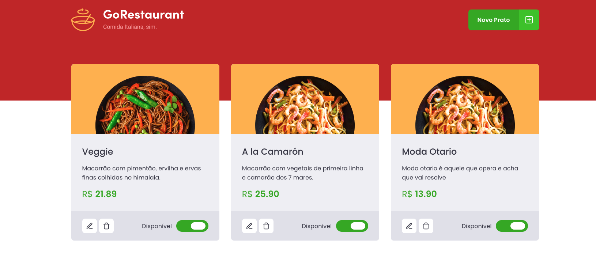

# GoRestaurant
Esse desenvolvimento é referente ao desafio 'CRUD React' do Bootcamp da Rocketseat 🚀.


# Imagem do Resultado 🚀
<p align="center">
  
</p>

# Tecnologias Utilizadas 🚀
React ⚛️ <br />
React Modal ⚛️ <br />
Styled-Components 💅🏻 <br />
Jest 🧪  <br />
React Icons ⚡️ <br />
Typescript 🖥

# Testes 🧪
Testes Unitários feito com Jest
Para inicializar todos os testes já prepardos, utilize <code> yarn test </code>.

# Instalação da aplicação 🚀
Executar :

```
    yarn
    json-server server.json -p 3333
    yarn start

```

Feito por <a href="https://www.linkedin.com/in/renato-souza-8572a927/" target="blank">RenatoMoschetta</a>.
